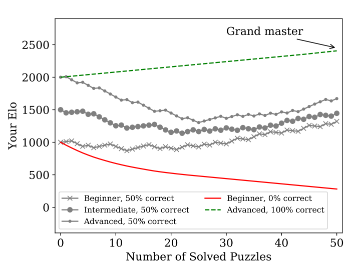

Aşağıda yer alan 50 puzzle ve Python için Elo rating hesaplaması Christian Mayer'ın ***Coffee Break Python*** isimli kitabından alınmıştır. Kitabın pdf versiyonuna [buradan](https://rupert.id.au/python/PDF/2019_08_18_CoffeeBreakPython_paperback_version.pdf) ulaşabilirsiniz.

**Elo Rating Sistemi nedir?**

Elo rating sistemi, sıfır toplamlı oyunlarda iki oyuncunun göreceli yetenek seviyelerini hesaplamak için kullanılan bir yöntemdir. Sıfır toplamlı oyunlar ise bir oyuncunun kazancının diğer oyuncunun kaybıyla tam olarak denk olduğu oyunlardır. Toplam kazanç veya kayıp sıfır olduğu için bu oyunlar sıfır toplamlı olarak isimlendirilir. Örneğin, satranç gibi bir sıfır toplamlı oyunda bir oyuncunun kazanması diğer oyuncunun kaybetmesine eşittir ve toplam kazanç veya kayıp sıfırdır.

**Elo Rating Yetenek Seviyeleri Nelerdir?**

| Elo Puanı | Yetenek Seviyesi |
|---------|---------|
| 2500 | World Class |
| 2400-2500 | Grandmaster |
| 2300-2400 | International Master |
| 2200-2300 | Master |
| 2100-2200 | National Master |
| 2000-2100 | Master Candidate |
| 1900-2000 | Authority |
| 1800-1900 | Professional |
| 1700-1800 | Expert |
| 1600-1700 | Experienced Intermediate |
| 1500-1600 | Intermediate |
| 1400-1500 | Experienced Learner |
| 1300-1400 | Learner |
| 1200-1300 | Scholar |
| 1100-1200 | Autodidact |
| 1000-1100 | Beginner |
| 0-1000 | Basic Knowledge |

**Nasıl Kullanılacak?**

Bir başlangıç puanı ile başlayacaksınız. Eğer Python seviyeniz *beginner* ise 1000, *intermediate* ise 1500 ve *advanced* ise 2000 ile başlayın. Ardından çözüm aşamasında soruyu doğru cevaplarsanız tabloda karşısına denk gelen puanı Elo puanınıza ekleyin; yanlış cevaplarsanız da tabloda karşısına denk gelen puanı Elo puanınızdan çıkarın.

Örnek: Başlangıç puanınızı *intermediate* olduğunuz için 1500 olarak yazdığınızı varsayalım.

```python
print('hello world')
```

| Elo Puanınız | Doğru | Yanlış |
|---------|---------|---------|
| 0 - 500 | 41 | -14 |
| 500 - 1000 | 16 | -39 |
| 1000 - 1500 | 8 | -47 |
| 1500 - 2000 | 8 | -47 |
| > 2000 | 8 | -47 |

Örnek olarak yazılan 1500 puanı 1500-2000 aralığına denk geliyor. Doğru cevap verirseniz 1500-2000 aralığına denk gelen doğru cevap puanı 8'i başlangıç puanınıza ekleyeceksiniz. Bu durumda yeni Elo puanınız 1508 olacak. Yanlış cevap verirseniz 1500-2000 aralığına denk gelen yanlış cevap puanı 47'yi başlangıç puanınızdan çıkaracaksınız. Bu durumda yeni Elo puanınız 1453 olacak. Bir sonraki puzzle için aynı işlemleri yeni Elo puanınız (örnekte 1508 veya 1453) üzerinden yapacaksınız. Bu durumda doğru ise 1500-2000; yanlış ise 1000-1500 aralığına denk gelecek.

Aşağıda, puzzle çözdükçe Elo puanının nasıl değişebileceği gösteren bir grafik bulunmaktadır.



Başlangıç puanınızdan bağımsız olarak puzzle çözdükçe gerçek seviyenize yakınsayacaksınız.

50 başlığın bulunduğu puzzle'da kodları okuyup anlama becerinizi ölçeceksiniz. Cevaplara *Cevabı Göster*'e tıklayarak ulaşabilirsiniz.

## 1. Hello World

```python
print('hello world')
```

Bu kodun çıktısı nedir?

<details>
    <summary style="cursor: pointer;">Cevabı Göster</summary>
    hello world
</details>

| Elo Puanınız | Doğru | Yanlış |
|---------|---------|---------|
| 0 - 500 | 41 | -14 |
| 500 - 1000 | 16 | -39 |
| 1000 - 1500 | 8 | -47 |
| 1500 - 2000 | 8 | -47 |
| > 2000 | 8 | -47 |

## 2. Variables & Float Division

```python
x = 55 / 11
print(x)
```

Bu kodun çıktısı nedir?

<details>
    <summary style="cursor: pointer;">Cevabı Göster</summary>
    5.0
</details>

| Elo Puanınız | Doğru | Yanlış |
|---------|---------|---------|
| 0 - 500 | 43 | -12 |
| 500 - 1000 | 21 | -34 |
| 1000 - 1500 | 9 | -46 |
| 1500 - 2000 | 8 | -47 |
| > 2000 | 8 | -47 |

## 3. Basic Arithmetic Operations

```python
x = 50 * 2 + (60 - 20) / 4
print(x)
```

Bu kodun çıktısı nedir?

<details>
    <summary style="cursor: pointer;">Cevabı Göster</summary>
    110.0
</details>

| Elo Puanınız | Doğru | Yanlış |
|---------|---------|---------|
| 0 - 500 | 44 | -11 |
| 500 - 1000 | 23 | -32 |
| 1000 - 1500 | 9 | -46 |
| 1500 - 2000 | 8 | -47 |
| > 2000 | 8 | -47 |

## 4. Comments and Strings

```python
# This is a comment
answer = 42 # the answer
# Now back to the puzzle
text = "# Is this a comment?"
print(text)
```

Bu kodun çıktısı nedir?

<details>
    <summary style="cursor: pointer;">Cevabı Göster</summary>
    # Is this a comment?
</details>

| Elo Puanınız | Doğru | Yanlış |
|---------|---------|---------|
| 0 - 500 | 45 | -10 |
| 500 - 1000 | 24 | -31 |
| 1000 - 1500 | 9 | -46 |
| 1500 - 2000 | 8 | -47 |
| > 2000 | 8 | -47 |

## 5. Index and Concatenate Strings

```python
x = 'silent'
print(x[2] + x[1] + x[0]
      + x[5] + x[3] + x[4])
```

Bu kodun çıktısı nedir?

<details>
    <summary style="cursor: pointer;">Cevabı Göster</summary>
    listen
</details>

| Elo Puanınız | Doğru | Yanlış |
|---------|---------|---------|
| 0 - 500 | 45 | -10 |
| 500 - 1000 | 27 | -28 |
| 1000 - 1500 | 10 | -45 |
| 1500 - 2000 | 8 | -47 |
| > 2000 | 8 | -47 |

## 6. List Indexing

```python
squares = [1, 4, 9, 16, 25]
print(squares[0])
```

Bu kodun çıktısı nedir?

<details>
    <summary style="cursor: pointer;">Cevabı Göster</summary>
    1
</details>

| Elo Puanınız | Doğru | Yanlış |
|---------|---------|---------|
| 0 - 500 | 45 | -10 |
| 500 - 1000 | 27 | -28 |
| 1000 - 1500 | 10 | -45 |
| 1500 - 2000 | 8 | -47 |
| > 2000 | 8 | -47 |

## 7. Slicing in Strings

```python
word = "galaxy"
print(len(word[1:]))
```

Bu kodun çıktısı nedir?

<details>
    <summary style="cursor: pointer;">Cevabı Göster</summary>
    5
</details>

| Elo Puanınız | Doğru | Yanlış |
|---------|---------|---------|
| 0 - 500 | 46 | -9 |
| 500 - 1000 | 29 | -26 |
| 1000 - 1500 | 10 | -45 |
| 1500 - 2000 | 8 | -47 |
| > 2000 | 8 | -47 |

## 8. Integer Division

```python
x = 50 // 11
print(x)
```

Bu kodun çıktısı nedir?

<details>
    <summary style="cursor: pointer;">Cevabı Göster</summary>
    4
</details>

| Elo Puanınız | Doğru | Yanlış |
|---------|---------|---------|
| 0 - 500 | 46 | -9 |
| 500 - 1000 | 29 | -26 |
| 1000 - 1500 | 10 | -45 |
| 1500 - 2000 | 8 | -47 |
| > 2000 | 8 | -47 |

## 9. String Manipulation Operators

```python
print(3 * 'un' + 'ium')
```

Bu kodun çıktısı nedir?

<details>
    <summary style="cursor: pointer;">Cevabı Göster</summary>
    unununium
</details>

| Elo Puanınız | Doğru | Yanlış |
|---------|---------|---------|
| 0 - 500 | 46 | -9 |
| 500 - 1000 | 30 | -25 |
| 1000 - 1500 | 10 | -45 |
| 1500 - 2000 | 8 | -47 |
| > 2000 | 8 | -47 |

## 10.  Implicit String Concatenation

```python
x = 'py' 'thon'
print(x)
```

Bu kodun çıktısı nedir?

<details>
    <summary style="cursor: pointer;">Cevabı Göster</summary>
    python
</details>

| Elo Puanınız | Doğru | Yanlış |
|---------|---------|---------|
| 0 - 500 | 46 | -9 |
| 500 - 1000 | 30 | -25 |
| 1000 - 1500 | 10 | -45 |
| 1500 - 2000 | 8 | -47 |
| > 2000 | 8 | -47 |

## 11. Sum and Range Functions

```python
print(sum(range(0, 7)))
```

Bu kodun çıktısı nedir?

<details>
    <summary style="cursor: pointer;">Cevabı Göster</summary>
    21
</details>

| Elo Puanınız | Doğru | Yanlış |
|---------|---------|---------|
| 0 - 500 | 46 | -9 |
| 500 - 1000 | 31 | -24 |
| 1000 - 1500 | 11 | -44 |
| 1500 - 2000 | 8 | -47 |
| > 2000 | 8 | -47 |

## 12. Append Function for Lists

```python
cubes = [1, 8, 27]
cubes.append(4 ** 3)
print(cubes)
```

Bu kodun çıktısı nedir?

<details>
    <summary style="cursor: pointer;">Cevabı Göster</summary>
    [1, 8, 27, 64]
</details>

| Elo Puanınız | Doğru | Yanlış |
|---------|---------|---------|
| 0 - 500 | 46 | -9 |
| 500 - 1000 | 32 | -23 |
| 1000 - 1500 | 11 | -44 |
| 1500 - 2000 | 8 | -47 |
| > 2000 | 8 | -47 |

## 13. Overshoot Slicing

```python
word = "galaxy"
print(word[4:50])
```

Bu kodun çıktısı nedir?

<details>
    <summary style="cursor: pointer;">Cevabı Göster</summary>
    xy
</details>

| Elo Puanınız | Doğru | Yanlış |
|---------|---------|---------|
| 0 - 500 | 46 | -9 |
| 500 - 1000 | 32 | -23 |
| 1000 - 1500 | 11 | -44 |
| 1500 - 2000 | 8 | -47 |
| > 2000 | 8 | -47 |

## 14. Modulo Operator

```python
x = 51 % 3
print(x)
```

Bu kodun çıktısı nedir?

<details>
    <summary style="cursor: pointer;">Cevabı Göster</summary>
    0
</details>

| Elo Puanınız | Doğru | Yanlış |
|---------|---------|---------|
| 0 - 500 | 46 | -9 |
| 500 - 1000 | 32 | -23 |
| 1000 - 1500 | 11 | -44 |
| 1500 - 2000 | 8 | -47 |
| > 2000 | 8 | -47 |

## 15. Branching

```python
def if_confusion(x, y):
    if x > y:
        if x - 5 > 0:
            x = y
            return "A" if y == y + y else "B"
        elif x + y > 0:
            while x > y: x -= 1
            while y > x: y -= 1
            if x == y:
                return "E"
    else:
        if x - 2 > y - 4:
            x_old = x
            x = y * y
            y = 2 * x_old
            if (x - 4) ** 2 > (y - 7) ** 2:
                return "C"
            return "D"
        return "H"
print(if_confusion(3, 7))
```

Bu kodun çıktısı nedir?

<details>
    <summary style="cursor: pointer;">Cevabı Göster</summary>
    H
</details>

| Elo Puanınız | Doğru | Yanlış |
|---------|---------|---------|
| 0 - 500 | 46 | -9 |
| 500 - 1000 | 33 | -22 |
| 1000 - 1500 | 11 | -44 |
| 1500 - 2000 | 8 | -47 |
| > 2000 | 8 | -47 |

## 16. Negative Indices

```python
x = 'cool'
print(x[-1] + x[-2]
        + x[-4] + x[-3])
```

Bu kodun çıktısı nedir?

<details>
    <summary style="cursor: pointer;">Cevabı Göster</summary>
    loco
</details>

| Elo Puanınız | Doğru | Yanlış |
|---------|---------|---------|
| 0 - 500 | 46 | -9 |
| 500 - 1000 | 33 | -22 |
| 1000 - 1500 | 11 | -44 |
| 1500 - 2000 | 8 | -47 |
| > 2000 | 8 | -47 |

## 17. The For Loop

```python
words = ['cat', 'mouse']
for word in words:
    print(len(word))
```

Bu kodun çıktısı nedir?

<details>
    <summary style="cursor: pointer;">Cevabı Göster</summary>
    3 <br>
    5
</details>

| Elo Puanınız | Doğru | Yanlış |
|---------|---------|---------|
| 0 - 500 | 46 | -9 |
| 500 - 1000 | 34 | -21 |
| 1000 - 1500 | 11 | -44 |
| 1500 - 2000 | 8 | -47 |
| > 2000 | 8 | -47 |

## 18. Functions and Naming

```python
def func(x):
    return x + 1
f = func
print(f(2) + func(2))
```

Bu kodun çıktısı nedir?

<details>
    <summary style="cursor: pointer;">Cevabı Göster</summary>
    6
</details>

| Elo Puanınız | Doğru | Yanlış |
|---------|---------|---------|
| 0 - 500 | 47 | -8 |
| 500 - 1000 | 36 | -19 |
| 1000 - 1500 | 12 | -43 |
| 1500 - 2000 | 8 | -47 |
| > 2000 | 8 | -47 |

## 19. Concatenating Slices

```python
word = "galaxy"
print(word[:-2] + word[-2:])
```

Bu kodun çıktısı nedir?

<details>
    <summary style="cursor: pointer;">Cevabı Göster</summary>
    galaxy
</details>

| Elo Puanınız | Doğru | Yanlış |
|---------|---------|---------|
| 0 - 500 | 47 | -8 |
| 500 - 1000 | 38 | -17 |
| 1000 - 1500 | 14 | -41 |
| 1500 - 2000 | 8 | -47 |
| > 2000 | 8 | -47 |

## 20. Arbitrary Arguments

```python
def func(a, *args):
    print(a)
    for arg in args:
        print(arg)
func("A", "B", "C")
```

Bu kodun çıktısı nedir?

<details>
    <summary style="cursor: pointer;">Cevabı Göster</summary>
    A <br>
    B <br>
    C
</details>

| Elo Puanınız | Doğru | Yanlış |
|---------|---------|---------|
| 0 - 500 | 47 | -8 |
| 500 - 1000 | 40 | -15 |
| 1000 - 1500 | 15 | -40 |
| 1500 - 2000 | 8 | -47 |
| > 2000 | 8 | -47 |

## 21. Indirect Recursion

```python
def ping(i):
    if i > 0:
        return pong(i - 1)
    return "0"
def pong(i):
    if i > 0:
        return ping(i - 1)
    return "1"
print(ping(29))
```

Bu kodun çıktısı nedir?

<details>
    <summary style="cursor: pointer;">Cevabı Göster</summary>
    1
</details>

| Elo Puanınız | Doğru | Yanlış |
|---------|---------|---------|
| 0 - 500 | 47 | -8 |
| 500 - 1000 | 41 | -14 |
| 1000 - 1500 | 16 | -39 |
| 1500 - 2000 | 8 | -47 |
| > 2000 | 8 | -47 |

## 22. String Slicing

```python
word = "bender"
print(word[1:4])
```

Bu kodun çıktısı nedir?

<details>
    <summary style="cursor: pointer;">Cevabı Göster</summary>
    end
</details>

| Elo Puanınız | Doğru | Yanlış |
|---------|---------|---------|
| 0 - 500 | 47 | -8 |
| 500 - 1000 | 41 | -14 |
| 1000 - 1500 | 17 | -38 |
| 1500 - 2000 | 8 | -47 |
| > 2000 | 8 | -47 |

## 23. Slice Assignment

```python
customers = ['Marie', 'Anne', 'Donald']
customers[2:4] = ['Barack', 'Olivia', 'Sophia']
print(customers)
```

Bu kodun çıktısı nedir?

<details>
    <summary style="cursor: pointer;">Cevabı Göster</summary>
    ['Marie', 'Anne', 'Barack', 'Olivia', 'Sophia']
</details>

| Elo Puanınız | Doğru | Yanlış |
|---------|---------|---------|
| 0 - 500 | 47 | -8 |
| 500 - 1000 | 43 | -12 |
| 1000 - 1500 | 20 | -35 |
| 1500 - 2000 | 8 | -47 |
| > 2000 | 8 | -47 |

## 24. Default Arguments

```python
def ask(prompt, retries=4, output='Error'):
    for _ in range(retries):
        response = input(prompt).lower()
        if response in ['y', 'yes']:
            return True
        if response in ['n', 'no']:
            return False
        print(output)
print(ask('Want to know the answer?', 5))
```

`ask('Want to know the answer?', 5)` geçerli bir fonksiyon çağrısı mıdır?

<details>
    <summary style="cursor: pointer;">Cevabı Göster</summary>
    Yes
</details>

| Elo Puanınız | Doğru | Yanlış |
|---------|---------|---------|
| 0 - 500 | 47 | -8 |
| 500 - 1000 | 44 | -11 |
| 1000 - 1500 | 22 | -33 |
| 1500 - 2000 | 9 | -46 |
| > 2000 | 8 | -47 |

## 25. Slicing and the len() Function

```python
letters = ['a', 'b', 'c', 'd']
print(len(letters[1:-1]))
```

Bu kodun çıktısı nedir?

<details>
    <summary style="cursor: pointer;">Cevabı Göster</summary>
    2
</details>

| Elo Puanınız | Doğru | Yanlış |
|---------|---------|---------|
| 0 - 500 | 47 | -8 |
| 500 - 1000 | 45 | -10 |
| 1000 - 1500 | 25 | -30 |
| 1500 - 2000 | 9 | -46 |
| > 2000 | 8 | -47 |

## 26. Nested Lists

```python
a = ['a', 'b']
n = [1, 2]
x = [a, n]
print(x[1])
```

Bu kodun çıktısı nedir?

<details>
    <summary style="cursor: pointer;">Cevabı Göster</summary>
    [1, 2]
</details>

| Elo Puanınız | Doğru | Yanlış |
|---------|---------|---------|
| 0 - 500 | 47 | -8 |
| 500 - 1000 | 45 | -10 |
| 1000 - 1500 | 27 | -28 |
| 1500 - 2000 | 9 | -46 |
| > 2000 | 8 | -47 |

## 27. Clearing Sublists

```python
letters = ['a', 'b', 'c',
           'd', 'e', 'f', 'g']
letters[1:] = []
print(letters)
```

Bu kodun çıktısı nedir?

<details>
    <summary style="cursor: pointer;">Cevabı Göster</summary>
    ['a']
</details>

| Elo Puanınız | Doğru | Yanlış |
|---------|---------|---------|
| 0 - 500 | 47 | -8 |
| 500 - 1000 | 45 | -10 |
| 1000 - 1500 | 27 | -28 |
| 1500 - 2000 | 10 | -45 |
| > 2000 | 8 | -47 |

## 28. The Fibonacci Series

```python
a, b = 0, 1
while b < 5:
    print(b)
    a, b = b, a + b
```

Bu kodun çıktısı nedir?

<details>
    <summary style="cursor: pointer;">Cevabı Göster</summary>
    1 1 2 3
</details>

| Elo Puanınız | Doğru | Yanlış |
|---------|---------|---------|
| 0 - 500 | 47 | -8 |
| 500 - 1000 | 46 | -9 |
| 1000 - 1500 | 30 | -25 |
| 1500 - 2000 | 10 | -45 |
| > 2000 | 8 | -47 |

## 29. The continue Statement and the Modulo Operator

```python
for num in range(2, 8):
    if not num % 2:
        continue
    print(num)
```

Bu kodun çıktısı nedir?

<details>
    <summary style="cursor: pointer;">Cevabı Göster</summary>
    3 <br>
    5 <br>
    7
</details>

| Elo Puanınız | Doğru | Yanlış |
|---------|---------|---------|
| 0 - 500 | 47 | -8 |
| 500 - 1000 | 46 | -9 |
| 1000 - 1500 | 31 | -24 |
| 1500 - 2000 | 10 | -45 |
| > 2000 | 8 | -47 |

## 30. Indexing Revisited and The Range Sequence

```python
print(range(5, 10)[-1])
print(range(0, 10, 3)[2])
print(range(-10, -100, -30)[1])
```

Bu kodun çıktısı nedir?

<details>
    <summary style="cursor: pointer;">Cevabı Göster</summary>
    9 <br>
    6 <br>
    -40
</details>

| Elo Puanınız | Doğru | Yanlış |
|---------|---------|---------|
| 0 - 500 | 47 | -8 |
| 500 - 1000 | 46 | -9 |
| 1000 - 1500 | 33 | -22 |
| 1500 - 2000 | 11 | -44 |
| > 2000 | 8 | -47 |

## 31. Searching a Sorted Matrix

```python
def matrix_find(matrix, value):
    if not matrix or not matrix[0]:
        return False
    j = len(matrix) - 1
    for row in matrix:
        while row[j] > value:
            j = j - 1
            if j == -1:
                return False
        if row[j] == value:
            return True
    return False
matrix = [[3, 4, 4, 6],
          [6, 8, 11, 12],
          [6, 8, 11, 15],
          [9, 11, 12, 17]]
print(matrix_find(matrix=matrix, value=11))
```

Bu kodun çıktısı nedir?

<details>
    <summary style="cursor: pointer;">Cevabı Göster</summary>
    True
</details>

| Elo Puanınız | Doğru | Yanlış |
|---------|---------|---------|
| 0 - 500 | 47 | -8 |
| 500 - 1000 | 46 | -9 |
| 1000 - 1500 | 33 | -22 |
| 1500 - 2000 | 11 | -44 |
| > 2000 | 8 | -47 |

## 32. Maximum Profit Algorithm

```python
def maximum_profit(prices):
    '''Maximum profit of a single buying low and selling high'''
    profit = 0
    for i, buy_price in enumerate(prices):
        sell_price = max(prices[i:])
        profit = max(profit, sell_price - buy_price)
    return profit
# Ethereum daily prices in Dec 2017 ($)
eth_prices = [455, 460, 465, 451, 414, 415, 441]
print(maximum_profit(prices=eth_prices))
```

Bu kodun çıktısı nedir?

<details>
    <summary style="cursor: pointer;">Cevabı Göster</summary>
    27
</details>

| Elo Puanınız | Doğru | Yanlış |
|---------|---------|---------|
| 0 - 500 | 47 | -8 |
| 500 - 1000 | 47 | -8 |
| 1000 - 1500 | 36 | -19 |
| 1500 - 2000 | 12 | -43 |
| > 2000 | 8 | -47 |

## 33. Bubble Sort Algorithm

```python
def bubble_sort(lst):
    '''Implementation of bubble sort algorithm'''
    for border in range(len(lst)-1, 0, -1):
        for i in range(border):
            if lst[i] > lst[i + 1]:
                lst[i], lst[i + 1] = lst[i + 1], lst[i]
    return lst
list_to_sort = [27, 0, 71, 70, 27, 63, 90]
print(bubble_sort(lst=list_to_sort))
```

Bu kodun çıktısı nedir?

<details>
    <summary style="cursor: pointer;">Cevabı Göster</summary>
    [0, 27, 27, 63, 70, 71, 90]
</details>

| Elo Puanınız | Doğru | Yanlış |
|---------|---------|---------|
| 0 - 500 | 47 | -8 |
| 500 - 1000 | 47 | -8 |
| 1000 - 1500 | 38 | -17 |
| 1500 - 2000 | 14 | -41 |
| > 2000 | 8 | -47 |

## 34. Joining Strings

```python
def concatenation(*args, sep="/"):
    return sep.join(args)
print(concatenation("A", "B", "C", sep=","))
```

Bu kodun çıktısı nedir?

<details>
    <summary style="cursor: pointer;">Cevabı Göster</summary>
    A,B,C
</details>

| Elo Puanınız | Doğru | Yanlış |
|---------|---------|---------|
| 0 - 500 | 47 | -8 |
| 500 - 1000 | 47 | -8 |
| 1000 - 1500 | 37 | -18 |
| 1500 - 2000 | 13 | -42 |
| > 2000 | 8 | -47 |

## 35. Arithmetic Calculations

```python
x = 5 * 3.8 - 1
print(x)
```

Bu kodun çıktısı nedir?

<details>
    <summary style="cursor: pointer;">Cevabı Göster</summary>
    18.0
</details>

| Elo Puanınız | Doğru | Yanlış |
|---------|---------|---------|
| 0 - 500 | 47 | -8 |
| 500 - 1000 | 47 | -8 |
| 1000 - 1500 | 39 | -16 |
| 1500 - 2000 | 15 | -40 |
| > 2000 | 8 | -47 |

## 36. Binary Search

```python
def bsearch(l, value):
    lo, hi = 0, len(l)-1
    while lo <= hi:
        mid = (lo + hi) // 2
        if l[mid] < value:
            lo = mid + 1
    elif value < l[mid]:
        hi = mid - 1
    else:
        return mid
    return -1
l = [0, 1, 2, 3, 4, 5, 6]
x = 6
print(bsearch(l,x))
```

Bu kodun çıktısı nedir?

<details>
    <summary style="cursor: pointer;">Cevabı Göster</summary>
    6
</details>

| Elo Puanınız | Doğru | Yanlış |
|---------|---------|---------|
| 0 - 500 | 47 | -8 |
| 500 - 1000 | 47 | -8 |
| 1000 - 1500 | 40 | -15 |
| 1500 - 2000 | 15 | -40 |
| > 2000 | 8 | -47 |

## 37. Modifying Lists in Loops

```python
words = ['cat', 'mouse', 'dog']
for word in words[:]:
    if len(word) > 3:
        words.insert(0, word)
print(words[0])
```

Bu kodun çıktısı nedir?

<details>
    <summary style="cursor: pointer;">Cevabı Göster</summary>
    mouse
</details>

| Elo Puanınız | Doğru | Yanlış |
|---------|---------|---------|
| 0 - 500 | 47 | -8 |
| 500 - 1000 | 47 | -8 |
| 1000 - 1500 | 40 | -15 |
| 1500 - 2000 | 15 | -40 |
| > 2000 | 8 | -47 |

## 38. The Lambda Function

```python
def make_incrementor(n):
    return lambda x: x + n
f = make_incrementor(42)
print(f(0))
print(f(1))
```

Bu kodun çıktısı nedir?

<details>
    <summary style="cursor: pointer;">Cevabı Göster</summary>
    43
</details>

| Elo Puanınız | Doğru | Yanlış |
|---------|---------|---------|
| 0 - 500 | 47 | -8 |
| 500 - 1000 | 47 | -8 |
| 1000 - 1500 | 42 | -13 |
| 1500 - 2000 | 17 | -38 |
| > 2000 | 8 | -47 |

## 39. Multi-line Strings and the New-line Character

```python
print("""
A
B
C
""" == "\nA\nB\nC\n")
```

Bu kodun çıktısı nedir?

<details>
    <summary style="cursor: pointer;">Cevabı Göster</summary>
    True
</details>

| Elo Puanınız | Doğru | Yanlış |
|---------|---------|---------|
| 0 - 500 | 47 | -8 |
| 500 - 1000 | 47 | -8 |
| 1000 - 1500 | 43 | -12 |
| 1500 - 2000 | 20 | -35 |
| > 2000 | 9 | -46 |

## 40. Escaping

```python
print('P"yt\'h"on')
```

Bu kodun çıktısı nedir?

<details>
    <summary style="cursor: pointer;">Cevabı Göster</summary>
    P"yt'h"on
</details>

| Elo Puanınız | Doğru | Yanlış |
|---------|---------|---------|
| 0 - 500 | 47 | -8 |
| 500 - 1000 | 47 | -8 |
| 1000 - 1500 | 43 | -12 |
| 1500 - 2000 | 21 | -34 |
| > 2000 | 9 | -46 |

## 41. Fibonacci

```python
def fibo(n):
    """Return list containing
    Fibonacci series up to n.
    """
    result = []
    a, b = 0, 1
    while a < n:
        result.append(a)
        a, b = b, a + b
    return result
fib100 = fibo(100)
print(fib100[-1] ==
      fib100[-2] + fib100[-3])
```

Bu kodun çıktısı nedir?

<details>
    <summary style="cursor: pointer;">Cevabı Göster</summary>
    True
</details>

| Elo Puanınız | Doğru | Yanlış |
|---------|---------|---------|
| 0 - 500 | 47 | -8 |
| 500 - 1000 | 47 | -8 |
| 1000 - 1500 | 44 | -11 |
| 1500 - 2000 | 22 | -33 |
| > 2000 | 9 | -46 |

## 42. Quicksort

```python
def qsort1(L):
    if L:
        return qsort1([x for x in L[1:] if x < L[0]]) + L[:1] \
            + qsort1([x for x in L[1:] if x >= L[0]])
    return []
def qsort2(L):
    if L:
        return L[:1] + qsort2([x for x in L[1:] if x < L[0]]) \
            + qsort2([x for x in L[1:] if x >= L[0]])
    return []
print(qsort1([0, 33, 22]))
print(qsort2([0, 33, 22]))
```

Listeyi doğru şekilde sıralayan fonksiyon hangisidir?

<details>
    <summary style="cursor: pointer;">Cevabı Göster</summary>
    qsort1
</details>

| Elo Puanınız | Doğru | Yanlış |
|---------|---------|---------|
| 0 - 500 | 47 | -8 |
| 500 - 1000 | 47 | -8 |
| 1000 - 1500 | 44 | -11 |
| 1500 - 2000 | 23 | -32 |
| > 2000 | 9 | -46 |

## 43. Unpacking Keyword Arguments with Dictionaries

```python
def func(val1=3, val2=4, val3=6):
    return val1 + val2 + val3
values = {"val1":9, "val3":-1}
print(func(**values))
```

Bu kodun çıktısı nedir?

<details>
    <summary style="cursor: pointer;">Cevabı Göster</summary>
    12
</details>

| Elo Puanınız | Doğru | Yanlış |
|---------|---------|---------|
| 0 - 500 | 47 | -8 |
| 500 - 1000 | 47 | -8 |
| 1000 - 1500 | 44 | -11 |
| 1500 - 2000 | 23 | -32 |
| > 2000 | 9 | -46 |

## 44. Infinity

```python
print("Answer")
while True:
    pass
print("42")
```

Bu kodun çıktısı nedir?

<details>
    <summary style="cursor: pointer;">Cevabı Göster</summary>
    Answer
</details>

| Elo Puanınız | Doğru | Yanlış |
|---------|---------|---------|
| 0 - 500 | 47 | -8 |
| 500 - 1000 | 47 | -8 |
| 1000 - 1500 | 45 | -10 |
| 1500 - 2000 | 25 | -30 |
| > 2000 | 9 | -46 |

## 45. Graph Traversal

```python
def has_path(graph, v_start, v_end, path_len=0):
    '''Graph has path from v_start to v_end'''
    # Traverse each vertex only once
    if path_len >= len(graph):
        return False
    # Direct path from v_start to v_end?
    if graph[v_start][v_end]:
        return True
    # Indirect path via neighbor v_nbor?
    for v_nbor, edge in enumerate(graph[v_start]):
        if edge: # between v_start and v_nbor
            if has_path(graph, v_nbor, v_end, path_len + 1):
                return True
    return False
# The graph represented as adjancy matrix
G = [[1, 1, 0, 0, 0],
[0, 1, 0, 0, 0],
[0, 0, 1, 0, 0],
[0, 1, 1, 1, 0],
[1, 0, 0, 1, 1]]
print(has_path(graph=G, v_start=3, v_end=0))
```

3 ve 0 köşeleri arasında bir yol var mıdır?

<details>
    <summary style="cursor: pointer;">Cevabı Göster</summary>
    False
</details>

| Elo Puanınız | Doğru | Yanlış |
|---------|---------|---------|
| 0 - 500 | 47 | -8 |
| 500 - 1000 | 47 | -8 |
| 1000 - 1500 | 45 | -10 |
| 1500 - 2000 | 26 | -29 |
| > 2000 | 9 | -46 |

## 46. Lexicographical Sorting

```python
pairs = [(1, 'one'),
         (2, 'two'),
         (3, 'three'),
         (4, 'four')]
# lexicographical sorting (ascending)
pairs.sort(key=lambda pair: pair[1])
print(pairs[0][1])
```

Bu kodun çıktısı nedir?

<details>
    <summary style="cursor: pointer;">Cevabı Göster</summary>
    four
</details>

| Elo Puanınız | Doğru | Yanlış |
|---------|---------|---------|
| 0 - 500 | 47 | -8 |
| 500 - 1000 | 47 | -8 |
| 1000 - 1500 | 45 | -10 |
| 1500 - 2000 | 27 | -28 |
| > 2000 | 10 | -45 |

## 47. Chaining of Set Operations

```python
# popular instagram accounts
# (millions followers)
inst = {"@instagram":232,
        "@selenagomez":133,
        "@victoriassecret":59,
        "@cristiano":120,
        "@beyonce":111,
        "@nike":76}
# popular twitter accounts
# (millions followers)
twit = {"@cristiano":69,
        "@barackobama":100,
        "@ladygaga":77,
        "@selenagomez":56,
        "@realdonaldtrump":48}
inst_names = set(filter(lambda key: inst[key]>60, inst.keys()))
twit_names = set(filter(lambda key: twit[key]>60, twit.keys()))
superstars = inst_names.intersection(twit_names)
print(list(superstars)[0])
```

Bu kodun çıktısı nedir?

<details>
    <summary style="cursor: pointer;">Cevabı Göster</summary>
    @cristiano
</details>

| Elo Puanınız | Doğru | Yanlış |
|---------|---------|---------|
| 0 - 500 | 47 | -8 |
| 500 - 1000 | 47 | -8 |
| 1000 - 1500 | 45 | -10 |
| 1500 - 2000 | 27 | -28 |
| > 2000 | 10 | -45 |

## 48. Basic Set Operations

```python
words_list = ["bitcoin",
            "cryptocurrency",
            "wallet"]
crawled_text = '''
Research produced by the University of
Cambridge estimates that in 2017,
there are 2.9 to 5.8 million unique
users using a cryptocurrency wallet,
most of them using bitcoin.
'''
split_text = crawled_text.split()
res1 = True in map(lambda word: word in split_text, words_list)
res2 = any(word in words_list for word in split_text)
print(res1 == res2)
```

Bu kodun çıktısı nedir?

<details>
    <summary style="cursor: pointer;">Cevabı Göster</summary>
    True
</details>

| Elo Puanınız | Doğru | Yanlış |
|---------|---------|---------|
| 0 - 500 | 47 | -8 |
| 500 - 1000 | 47 | -8 |
| 1000 - 1500 | 45 | -10 |
| 1500 - 2000 | 28 | -27 |
| > 2000 | 10 | -45 |

## 49. Simple Unicode Encryption

```python
def encrypt(text):
    encrypted = map(lambda c: chr(ord(c) + 2), text)
    return ''.join(encrypted)
def decrypt(text):
    decrypted = map(lambda c: chr(ord(c) - 2), text)
    return ''.join(decrypted)
s = "xtherussiansarecomingx"
print(decrypt(encrypt(encrypt(s))) == encrypt(s))
```

Bu kodun çıktısı nedir?

<details>
    <summary style="cursor: pointer;">Cevabı Göster</summary>
    True
</details>

| Elo Puanınız | Doğru | Yanlış |
|---------|---------|---------|
| 0 - 500 | 47 | -8 |
| 500 - 1000 | 47 | -8 |
| 1000 - 1500 | 46 | -9 |
| 1500 - 2000 | 28 | -27 |
| > 2000 | 10 | -45 |

## 50. The Guess and Check Framework

```python
import random
def guess(a, b):
    return random.randint(a, b)
def check(x, y):
    return y ** 2 == x
x = 100
left, right = 0, x
y = guess(left, right)
while not check(x, y):
    y = guess(left, right)
print(y)
```

Bu kodun çıktısı nedir?

<details>
    <summary style="cursor: pointer;">Cevabı Göster</summary>
    10
</details>

| Elo Puanınız | Doğru | Yanlış |
|---------|---------|---------|
| 0 - 500 | 47 | -8 |
| 500 - 1000 | 47 | -8 |
| 1000 - 1500 | 46 | -9 |
| 1500 - 2000 | 29 | -26 |
| > 2000 | 10 | -45 |